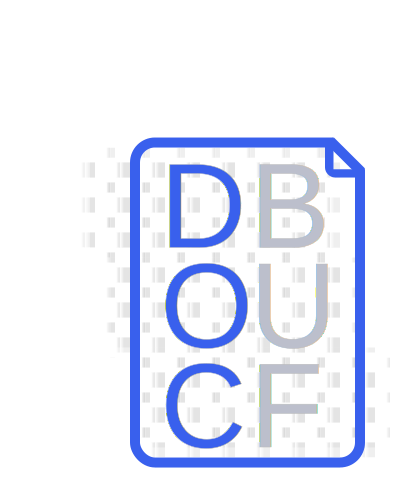

<!-- Center Header with "DocBuf" text -->
<div align="center">
    
  <h1>DocBuf <small>(Document Buffers)</small></h1>
</div>

# Overview

Document Buffers, **DocBuf**, is an _interface description language_ (IDL) for structured document schematization.

DocBuf is motivated by creating a more modern and efficient version of `XSD`. There are many nice features `XSD` offers, such as providing validation requirements per element, known as _restrictions_. However, despite its fine-level controls, `XSD` implemented `XML` data is verbose and serialization and deserialization can be brittle if there is a syntax error or missing field. 

DocBuf takes the good parts of `XSD`, for example implementing its own version of field options (`field::options`) and compile-time validation, and extends its utility into a light-weight binary format that is efficiently serialized and deserialized into native programming language structured data, e.g., Rust.

Similar to Protocol Buffers and `gRPC`, DocBuf introduces the `process` keyword to define a process with `endpoints` that specify either remote procedural call (`RPC`)-style or `stream` APIs. The `process:options` section defines in-line support for configuration options.

### Example `.docbuf` Source File

```docbuf
pragma docbuf v1;

// Module name of the documents.
module my_module;

// relative path to other document imports
import "another.docbuf";

#[document::options {
    // overwrite the document name in the generated code.
    name = "MyDocType";
    // Mark the document as the root document.
    // The root document is the entry point for the document buffer.
    // There can only be one root document per document buffer.
    root = true;
}]
document MyDocumentType {
    // comment field
    #[field::options {
        min_length = 0;
        max_length = 32;
        regex = "[a-zA-Z]";
        default = "my-text-field";
        // All fields are optional by default.
        // Set required to true to force the field to exist.
        required = true;
        // overwrite the field name in the generated code.
        name = "CustomFieldID";
    }]
    text_field: String,
    // no options or limitations
    no_options: String,
    #[field::options {
        min_value = 0;
        max_value = 100;
        // Default value will be zero unless specified otherwise.
        default = 10;
    }]
    32_bit_integer: i32,
    64_bit_integer: i64,
    32_bit_unsigned: u32,
    64_bit_unsigned: u64,
    32_bit_floating: f32,
    64_bit_floating: f64,
    binary_or_bytecode: [u8],
    #[field::options {
        min_length = 1;
        required = true;
    }]
    my_other_document: [MyOtherDocument],
    // List of like-typed items
    my_list: [String],
    // Enumerable types
    my_enum: MyOptionTypes,
}

#[enum::options {
    name = "MyOptions";
}]
enumerable MyOptionTypes {
    OptionOne,
    OptionTwo(i32),
    OptionThree(MyOtherDocument),
    #[field::options {
        min_length = 1;
        max_length = 32;
        regex = "[a-zA-Z]";
    }]
    OptionFour(String),
}

#[process::options {
    // use ipv6 address space
    ipv6 = true;
    host = "::1";
    port = 1337;
    name = "MessageProcessor";
    protocol = "quic";
    // Certificate options
    public_cert = "/path/to/public/certificate";
    private_cert = "/path/to/private/certificate";
    // Signing options
    keypair = "/path/to/keypair";
    // Asymmetric Cryptography Algorithms
    crypto = "ed25519";
    // Use the noise encryption protocol
    noise = true;
    //
    // ALTERNATIVELY, USE CONFIG FILE
    // Use a config file instead of options
    config = "/path/to/config";
}]
process Messenger {
    #[endpoint::options {
        required = true;
        // allowed request limit per minute
        request_rate_limit_per_minute = 10;
        // endpoint must include a signed message field
        signature_required = true;
        // convert endpoint into a stream
        stream = true;
    }]
    upload_document: MyDocumentType -> (),
    /// Upload multiple documents in the process
    /// Comments with three slashes will be made public in the generated source code
    upload_documents: [MyDocumentType] -> (),

}


```

<!-- Add Copyright Notice -->
## Copyright

© 2024 [Emergent Financial, LLC](https://emergent.financial) - All Rights Reserved